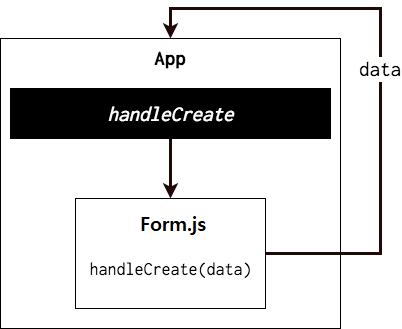

#### 브라우저의 Workflow
=================================================================
 

1.  input 태그에 사용자의 입력이 발생할 때마다 onChange 속성에 이벤트 핸들러로 등록된 handleChange가 실행되고, 
    해당 이벤트 핸들러는 실시간으로 사용자가 입력한 값을 state에 업데이트한다. 
    state에 업데이트가 가해질때마다 랜더링이 실시되기 때문에 사용자는 실시간으로 바뀌는 화면을 볼수 있다.
    사용자입력 -> handleChange -> state변경 -> 랜더링 -> 사용자입력 ...  (사용자 입력이 끝날때까지 반복)
    

2.  state 안에 있는 값들을 부모 컴포넌트(App.js)에게 전달해줄 차례입니다. 
    이러한 상황에는, 부모 컴포넌트에서 메소드를 만들고, 이 메소드를 자식에게 전달한 다음에 자식 내부에서 호출하는 방식을 사용합니다.
    우리는 App 에서 handleCreate 라는 메소드를 만들고, 이를 Form.js 한테 전달해주었습니다. 
    그리고, Form 쪽에서 버튼을 만들어서 submit 이 발생하면 props 로 받은 함수를 호출하여 App 에서 파라미터로 받은 값을 사용 할 수 있도록 하였습니다.
    
    